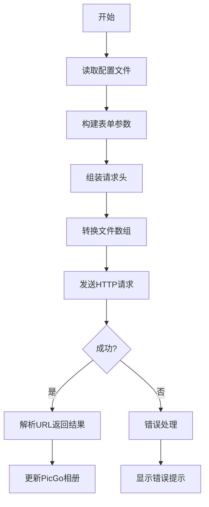

# picgo-plugin-imageflow

picgo 的 [ImageFlow](https://github.com/Yuri-NagaSaki/ImageFlow) 图床上传工具，由[王嘉祥](https://www.jiaxiang.wang)开发

## 配置说明

| 参数名         | 类型   | 是否必填 | 描述                     | 默认值 |
|----------------|--------|----------|--------------------------|--------|
| `url`          | string | 是       | 服务器地址               | 无     |
| `token`        | string | 是       | API 密钥                 | 无     |
| `expiryMinutes`| number | 否       | 图片过期时间（分钟）     | 无     |
| `tags`         | string | 否       | 图片标签（逗号分隔）     | 无     |

## 安装说明

### CLI

### GUI

## 使用方式

## 演示

配置

上传

## 开发

### 架构图

### 上游接口说明

#### API 密钥认证

图片上传功能需要 API 密钥认证。您可以：

1. 在请求 `header` 中添加`Authorization`，值为`Bearer <token>`

#### API 参考

| 接口 | 方法 | 描述 | 参数 | 认证 |
|----------|---------|-------------|------------|-------------|
| `/api/upload` | POST | 上传新图片 | Form 数据，字段名 `images[]`,存放照片数组  可选参数：`expiryMinutes`（过期时间，分钟） 可选参数：`tags`（标签数组） | 需要 API 密钥 |

## 参考文档

- [插件开发 | PicGo-Core](https://picgo.github.io/PicGo-Core-Doc/zh/dev-guide/cli.html)

## 鸣谢

感谢以下开源项目提供灵感

- https://github.com/foraixh/picgo-plugin-halo-uploader