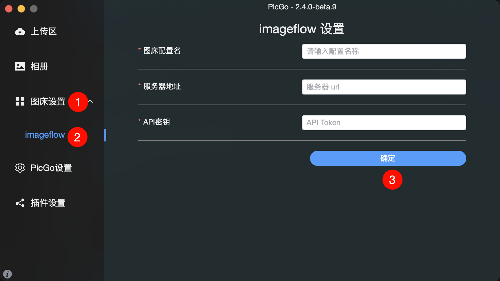
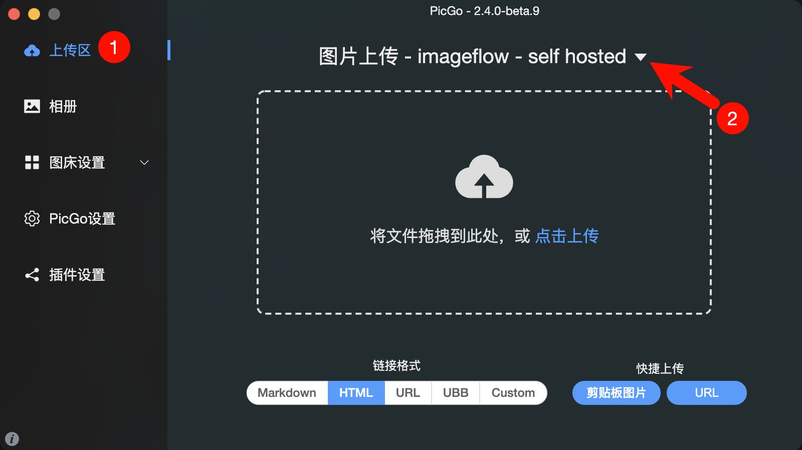
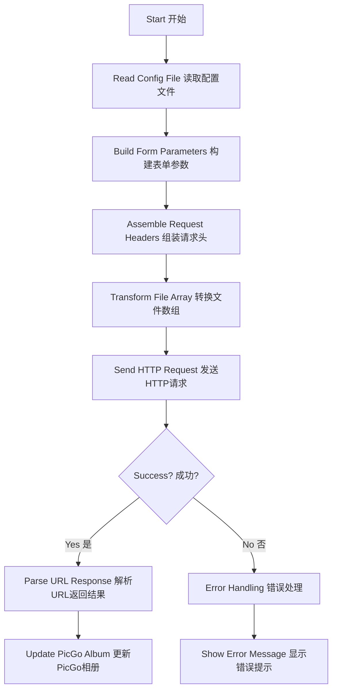

<h1 align="center">PicGo Plugin ImageFlow</h1>

<p align="center">
  <a href="https://github.com/iWangJiaxiang/picgo-plugin-imageflow/releases">
    
  </a>
  <a href="https://www.npmjs.com/package/picgo-plugin-imageflow">
    
  </a>
  <a href="https://github.com/iWangJiaxiang/picgo-plugin-imageflow?tab=MIT-1-ov-file">
    
  </a>
</p>

[PicGo](https://github.com/PicGo/PicGo-Core)'s [ImageFlow](https://github.com/Yuri-NagaSaki/ImageFlow) image hosting upload tool, developed by [Jiaxiang Wang](https://www.jiaxiang.wang).  
[PicGo](https://github.com/PicGo/PicGo-Core) 的 [ImageFlow](https://github.com/Yuri-NagaSaki/ImageFlow) 图床上传工具，由[王嘉祥](https://www.jiaxiang.wang)开发。

## Configuration Instructions 配置说明

| 参数名          | 是否必填 | 描述                     |
|----------------|---------|-------------------------|
| `URL`           | 是       | 服务器地址               |
| `API Key`         | 是       | API 密钥                |


## Installation Instructions 安装说明

### CLI

Install via PicGo Core CLI  
通过 PicGo Core 命令行安装

```bash
picgo add imageflow
```

### GUI

Search for `imageflow` in the GUI to download
GUI 直接搜索 `imageflow` 下载即可

## Usage 使用方式

### Configuration 配置

In PicGo, follow the steps shown in the illustration to configure.  
在 PicGo 中，按照图示步骤进行配置即可。



### Upload 上传

In PicGo, follow the steps shown in the illustration to upload. Note to switch to this plugin in `Step 2`.  
在 PicGo 中，按照图示步骤操作即可，注意在`第二步`中切换本插件使用。



## Development 开发

### Architecture Diagram 架构图



### Upstream API Description 上游接口说明

#### API Key Authentication API 密钥认证

Image upload requires API key authentication. You can:  
图片上传功能需要 API 密钥认证。您可以：

1. Add `Authorization` in the request `header`, with the value `Bearer <token>`.  
   在请求 `header` 中添加`Authorization`，值为`Bearer <token>`。

#### API Reference API 参考

| 接口 | 方法 | 描述 | 参数 | 认证 |
|----------|---------|-------------|------------|-------------|
| `/api/upload` | POST | 上传新图片 | Form 数据，字段名 `images[]`,存放照片数组 <br>可选参数：`expiryMinutes`（过期时间，分钟）<br>可选参数：`tags`（标签数组） | 需要 API 密钥 |

### Reference Documentation 参考文档

- [Plugin Development | PicGo-Core 插件开发 | PicGo-Core](https://picgo.github.io/PicGo-Core-Doc/zh/dev-guide/cli.html)

## Contributing 贡献

Pull requests are welcome. For major changes, please open an issue first to discuss what you would like to change.  
欢迎提交 Pull Request。如需进行重大更改，请先打开 Issue 讨论您想要更改的内容。

## Acknowledgments 鸣谢

Thanks to the following open-source projects for inspiration:  
感谢以下开源项目提供灵感：

- https://github.com/foraixh/picgo-plugin-halo-uploader
- https://github.com/wayjam/picgo-plugin-s3

# License 许可证

Released under the [MIT License](./License).  
基于 [MIT License](./License) 发布。